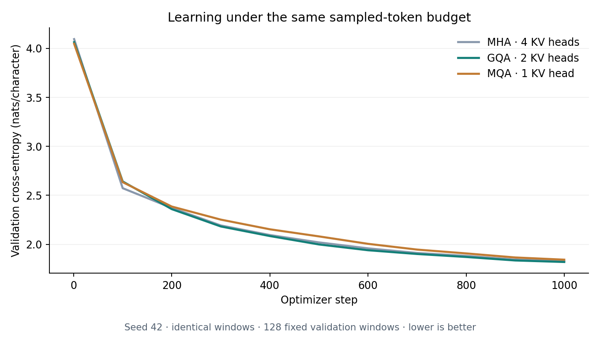
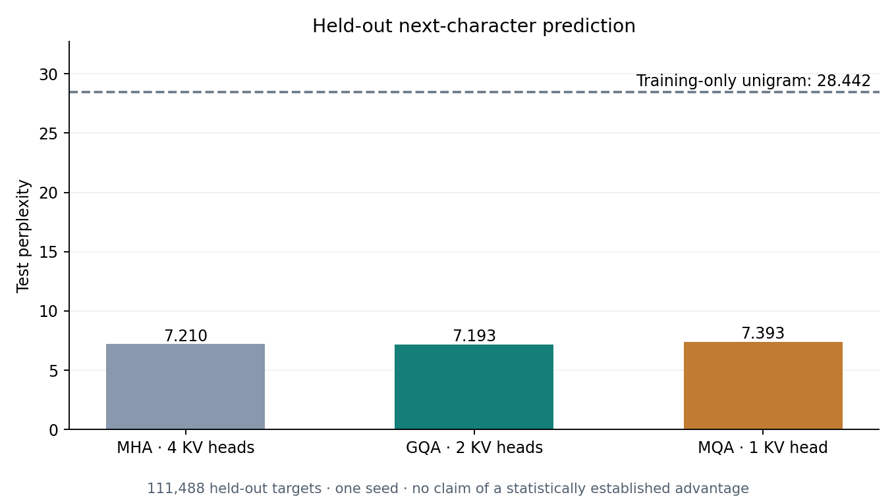
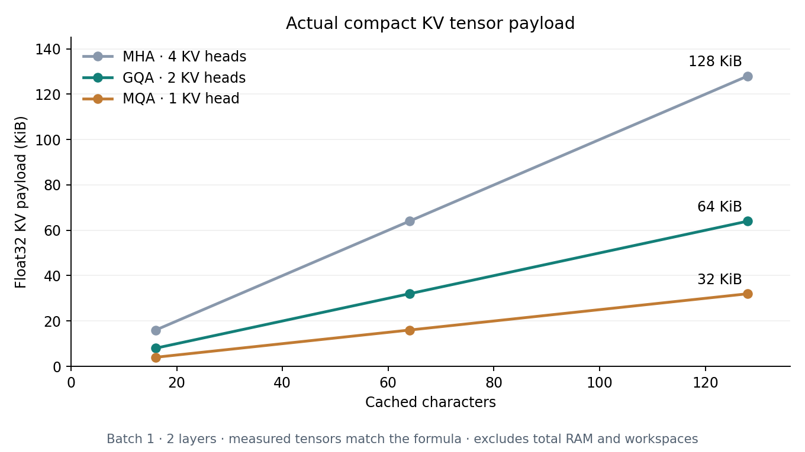
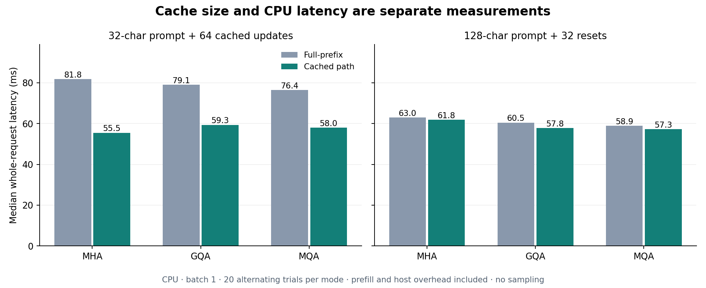
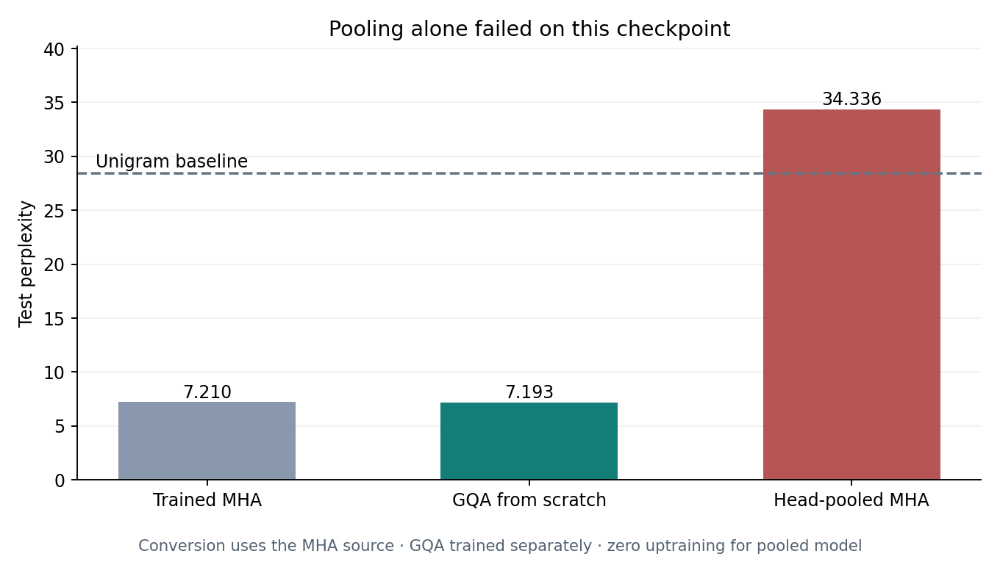
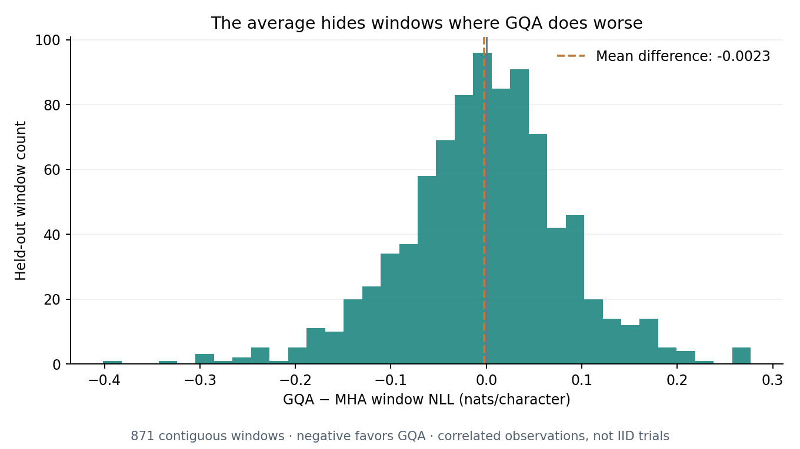

# CacheCraft GQA

A TensorFlow decoder built to measure what happens when several query heads share a smaller key/value cache.

---

## Overview

* **Task:** Character-level autoregressive language modeling and inference engineering.
* **Dataset:** Tiny Shakespeare, 1,115,394 characters and a training-only vocabulary of 65 characters.
* **Selected Model:** **GQA with 2 KV heads**, chosen by validation cross-entropy; test perplexity **7.1931**.
* **Baseline Comparison:** Standard 4-head attention reached test perplexity **7.2099**; the training-only unigram baseline reached **28.4423**.
* **Main Engineering Result:** GQA halves the actual float32 KV tensor payload. MQA reduces it by 75%. Neither reduction is a claim about total RAM or guaranteed speed.

---

## Architecture

Each decoder has two pre-normalized blocks, a 64-dimensional residual stream, four query heads, 16 dimensions per head, a 128-character context, rotary query/key positions, SwiGLU feed-forward layers, and tied input/output embeddings. Only the number of key/value heads changes.

| Variant | Query heads | KV heads | Query-to-KV mapping | Cache tensor shape per K or V |
| :--- | ---: | ---: | :--- | :--- |
| MHA | 4 | 4 | Each query has its own KV head | `[batch, 4, time, 16]` |
| GQA | 4 | 2 | Queries 0–1 share KV 0; queries 2–3 share KV 1 | `[batch, 2, time, 16]` |
| MQA | 4 | 1 | All queries share KV 0 | `[batch, 1, time, 16]` |

The attention code groups queries as `[batch, kv_heads, queries_per_group, time, head_width]` and contracts them directly against compact keys and values. It does not call `tf.repeat` on KV tensors. TensorFlow's backend can still allocate internal workspaces; compact cache storage does not mean all intermediate attention memory shrinks.

The repository implements projections, grouped causal attention, RoPE offsets, decoder blocks, cached inference, and checkpoint conversion. TensorFlow supplies tensor operations, differentiation, dense layers, normalization, and Adam. These are established techniques, implemented here for an inspectable engineering study; this is not a newly invented attention algorithm.

---

## Key Results

Training completed on **1 October 2026**. Every from-scratch variant saw the same **2,048,000 sampled character targets**, in the same order: 1,000 steps, batch 16, context 128, and seed 42. Adam used learning rate 0.001 and global gradient clipping at 1.0.

Checkpoints were selected on 128 fixed validation windows. Full validation selected GQA before final test evaluation. The KV count changes parameter count, so this comparison holds architecture width and sampled-token budget fixed rather than total parameters or wall-clock compute.

### Validation Selection

| Model | Parameters | Validation NLL | Validation perplexity |
| :--- | ---: | ---: | ---: |
| MHA, 4 KV heads | 86,720 | 1.8602 | 6.4248 |
| **GQA, 2 KV heads** | **78,528** | **1.8519** | **6.3719** |
| MQA, 1 KV head | 74,432 | 1.8738 | 6.5132 |

There is no cross-validation: a contiguous train/validation/test split is used for language modeling. All three selected checkpoints were at step 1,000.

### Final Holdout Evaluation — 111,488 Character Targets

| Model | NLL, nats/character | Perplexity ↓ | Next-character accuracy | KV payload, batch 1 at 128 characters |
| :--- | ---: | ---: | ---: | ---: |
| MHA, 4 KV heads | 1.9755 | 7.2099 | 43.32% | 128 KiB |
| **GQA, 2 KV heads** | **1.9731** | **7.1931** | **43.50%** | **64 KiB** |
| MQA, 1 KV head | 2.0005 | 7.3926 | 42.99% | 32 KiB |
| MHA → pooled GQA, no uptraining | 3.5362 | 34.3360 | 16.67% | 64 KiB |
| Training-only unigram | 3.3479 | 28.4423 | — | — |

The small GQA/MHA quality difference is a single-seed observation, not evidence of a statistically established advantage. GQA has worse NLL in **439 of 871** individual held-out windows despite its slightly better overall mean.

---

## Checkpoint Conversion

`pool_kv_heads` creates a separate model by averaging contiguous K and V projection heads. Embeddings, query projections, attention output projections, normalization, and feed-forward weights are copied unchanged. The source checkpoint is never modified.

On the trained MHA checkpoint, pooling from four KV heads to two without uptraining raised test perplexity from **7.2099 to 34.3360**, worse than the unigram baseline. The converted checkpoint is included as a failure diagnostic. It is not the selected model and should not be used as a substitute for trained GQA.

`convert_checkpoint.py` and the reusable conversion function let you inspect that trade-off directly. Conversion alone does not promise quality retention. This study does not execute the uptraining procedure described in the GQA paper.

---

## Cache and Inference Measurements

The payload formula is `2 × layers × batch × tokens × kv_heads × head_width × scalar_bytes`. The factor of two accounts for K and V. At lengths 16, 64, and 128, actual tensor element counts exactly matched the formula for every checkpoint.

### Growing-Prefix Request — 32 Characters Plus 64 Updates

| Model | Full-prefix median | Cached median | Reference / cached |
| :--- | ---: | ---: | ---: |
| MHA | 81.85 ms | 55.47 ms | 1.48× |
| GQA | 79.06 ms | 59.34 ms | 1.33× |
| MQA | 76.42 ms | 57.98 ms | 1.32× |

These are whole-request CPU timings at batch size one, after three warmup requests, with 20 trials per mode and alternating execution order. Each workload uses identical teacher-forced IDs and materializes logits at every position. Timing includes prefill and host orchestration but excludes checkpoint loading, graph tracing, tokenization, and sampling. The reference emits all prefix logits; cached prefill emits last-position logits and KV tensors. This is not a GPU benchmark or an isolated attention-kernel speed comparison.

**GQA was not faster than cached MHA in this workload.** Memory savings and observed latency are separate outcomes.

At the context boundary, the session re-prefills the latest 128-character window rather than dropping only an old KV entry. Deeper cached hidden states otherwise retain information from outside the window. A full 128-character prompt plus 32 updates causes 32 resets and gives little cache reuse; both regimes are recorded in `runs/benchmark.json`.

The largest absolute cached/reference logit difference across measured requests was `2.067e-5`; every checked greedy prediction matched. Float32 numerical differences are expected, so this is equivalence within documented tolerance, not a bit-identical logits claim. Engine graphs each trace once while prefix length and equal-length batch size change.

---

## Data Summary and Error Analysis

* **Source:** [Pinned Tiny Shakespeare corpus](https://github.com/karpathy/char-rnn/blob/6f9487a6fe5b420b7ca9afb0d7c078e37c1d1b4e/data/tinyshakespeare/input.txt).
* **Verification:** The unmodified UTF-8 bytes match both the public Git blob and SHA-256 in `data/manifest.json`.
* **Split:** Contiguous 80% training, 10% validation, 10% test. Vocabulary comes from training only, and no input/target window crosses a boundary.
* **Evaluation:** 871 non-overlapping input windows per held-out split, with 128 character targets per window. These windows are correlated observations, not independent trials.
* **Known Weaknesses:** High-loss GQA windows include Latin passages and uncommon names. A repeated dialogue window had GQA NLL 2.8080 versus MHA 2.5310. The exact source offsets and five worst windows under each error criterion are in `runs/error_analysis.json`.

Generated samples use the same `ROMEO:` prompt with a newline, temperature 0.8, seed 123, and 240 generated characters for every checkpoint. They contain word fragments and dialogue structure but remain inconsistent and often ungrammatical. These small models do not demonstrate factual reasoning or instruction following. Repeated phrases can occur across Shakespeare plays; contiguous splitting is not a deduplication guarantee.

---

## Visualizations

| Training progress | Held-out model quality |
| :---: | :---: |
|  |  |

| Actual KV payload | Observed CPU latency |
| :---: | :---: |
|  |  |

| Conversion failure | Window-level errors |
| :---: | :---: |
|  |  |

---

## Repository Structure

* `cachecraft/model.py` — grouped attention, compact KV primitives, RoPE, and decoder.
* `cachecraft/runtime.py` — compiled inference engine and isolated decoding sessions.
* `cachecraft/conversion.py` — K/V head pooling with source-weight preservation.
* `study.py` — fixed-budget training, validation selection, holdout metrics, and error analysis.
* `generate.py` — local cached/reference generation.
* `convert_checkpoint.py` — create a separate converted checkpoint.
* `plan_cache.py` — estimate cache tensor payload within the trained context.
* `benchmark.py` — actual cache measurements and synchronized latency trials.
* `inspect_results.py` — plots from recorded artifacts.
* `verify.py` — checkpoint replay, seeded samples, conversion, and test audit.
* `tests/` — 14 meaningful architecture and runtime checks.
* `runs/` — four checkpoints, scores, window losses, sampled training starts, and raw timings.
* `figures/` — six measured diagnostic plots.
* `USAGE.md` — installation and command reference.

The runtime supports float32 and equal-length batches without padding. It does not implement paged attention, ragged batching, a GPU kernel, a production request scheduler, or a hosted API. The cache planner excludes weights, workspaces, temporary copies, graph storage, and allocator overhead.

---

## References and Provenance

* [GQA: Training Generalized Multi-Query Transformer Models from Multi-Head Checkpoints](https://aclanthology.org/2023.emnlp-main.298/) — grouped query/key-value heads and checkpoint-conversion motivation.
* [RoFormer](https://arxiv.org/abs/2104.09864) — rotary positions.
* [GLU Variants Improve Transformer](https://arxiv.org/abs/2002.05202) — SwiGLU feed-forward layers.
* [TensorFlow function guide](https://www.tensorflow.org/guide/function) — shape-polymorphic graph signatures.

Built for Saud Alotaibi with AI-assisted implementation and automated verification. All results come from the executed local study. No pretrained weights, paid LLM calls, fabricated scores, or seed search are used. `audit.json` records checkpoint replay, actual test outcomes, corpus provenance, and artifact hashes.
